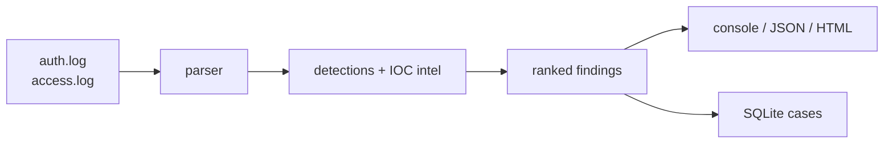
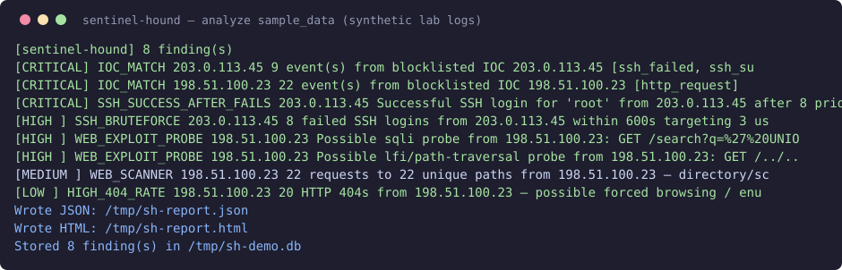
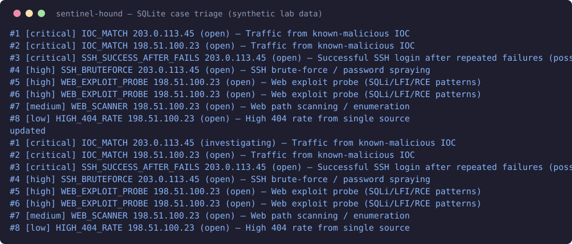

# Sentinel Hound

Local-first log threat detection + SOC triage toolkit. Parses Linux `auth.log` (sshd) and nginx/combined `access.log`, runs six detection rules with MITRE ATT&CK mapping, matches a lab IOC list, stores cases in SQLite, and emits console/JSON/HTML reports. **Zero third-party dependencies — Python 3.9+ stdlib only.** Built for local labs, CTFs, and systems you own.

## Overview

Small SOCs and home labs collect logs but rarely triage them systematically. Sentinel Hound closes that gap: one CLI turns raw logs into ranked, explainable findings with evidence excerpts, MITRE technique IDs, and a case workflow (`open → investigating → closed / false_positive`).

## Why I Built This

I wanted a defensive project that mirrors real SOC work — parsing untrusted input, writing detection logic with documented tradeoffs, and handling the full alert lifecycle — without requiring Elastic/Splunk or Docker. Everything runs on a stock Arch install.

## Features

- Parsers for syslog sshd lines and combined access logs (graceful `unparsed` fallback, no crashes on malformed lines)
- 6 rules: SSH brute-force, success-after-fails (possible compromise), web scanner, web exploit probes (SQLi/LFI/RCE/XSS), high-404 rate, IOC match (aggregated per-IP)
- MITRE ATT&CK IDs + tactic on every finding
- IOC blocklist (`config/iocs.json`, RFC5737 TEST-NET lab values)
- Trusted-IP allowlist (`config/allowlist.json`) skipped by every rule
- Sliding time windows for SSH rules (`ssh_bruteforce_window_seconds`, `ssh_success_window_seconds`) with count fallback when timestamps are absent
- SQLite case store with status workflow + minimal localhost-only web UI (`serve`) for case review
- Reporters: console table, JSON, single-file HTML dashboard
- 37-test stdlib `unittest` suite (parsers, thresholds, ordering, time windows, allowlist, encoding, FP negatives, DB, reporters, CLI, web UI) + synthetic sanitized sample logs

## Architecture

```
auth.log / access.log
        │  parser.py (regex → normalized events)
        ▼
detections.py (6 rules, thresholds from config/rules.json)
        │  + intel.py (IOC blocklist)
        ▼
findings (ranked critical→low) ──► reporter.py (console/JSON/HTML)
                               └──► cases.py (SQLite triage)
```



## Technologies

Python 3 (stdlib only: `argparse`, `re`, `sqlite3`, `json`, `unittest`), SQLite, HTML, MITRE ATT&CK framework. Verified on Arch Linux, Python 3.14, no pip required.

## Installation (Arch Linux)

```bash
cd sentinel-hound
python3 --version   # 3.9+
# no pip install needed — stdlib only
python3 scripts/generate_samples.py   # regenerate sanitized lab logs (optional)
python3 -m unittest discover -s tests -v
```

## Usage

```bash
# Analyze lab sample logs
python3 -m sentinel_hound.cli analyze --auth-log sample_data/auth.log --access-log sample_data/access.log

# Full pipeline: JSON + HTML + case DB
python3 -m sentinel_hound.cli analyze --auth-log sample_data/auth.log --access-log sample_data/access.log \
  --json-out report.json --html-out report.html --db sentinel.db

# Single auto-detected file
python3 -m sentinel_hound.cli analyze --log /var/log/auth.log --db sentinel.db

# Triage
python3 -m sentinel_hound.cli cases list --db sentinel.db

# Web UI (localhost only, no auth — never expose to a network)
python3 -m sentinel_hound.cli serve --db sentinel.db --port 8620
python3 -m sentinel_hound.cli cases set-status --db sentinel.db --id 3 --status-set investigating

# Your own logs (read-only; never point at prod without approval)
python3 -m sentinel_hound.cli analyze --auth-log /var/log/auth.log --access-log /var/log/nginx/access.log
```

Tune thresholds in `config/rules.json`; add IOCs to `config/iocs.json`; list CI runners / uptime monitors in `config/allowlist.json`.

```bash
# Suppress known-benign scanners via allowlist
python3 -m sentinel_hound.cli analyze --auth-log sample_data/auth.log --access-log sample_data/access.log --allowlist config/allowlist.json
```

## Detection / Security Logic

| Rule | Logic | Telemetry needed | FP sources | FN risks |
|---|---|---|---|---|
| SSH_BRUTEFORCE | ≥N `Failed password` from one IP | sshd auth lines | CI runners, users with caps-lock | slow/low-and-slow under threshold |
| SSH_SUCCESS_AFTER_FAILS | `Accepted` from IP with ≥N prior fails | same | legit user retrying then succeeding | attacker with stolen key, zero fails |
| WEB_SCANNER | ≥N requests / ≥N/2 unique paths per IP | access log method+path+status | crawlers, uptime monitors | distributed scan across IPs |
| WEB_EXPLOIT_PROBE | heuristic regex on url-decoded path+UA: SQLi, LFI, RCE, XSS, sensitive paths (flagging, not proof of exploit) | access log path/UA | pen-testers, WAF test traffic | encoded/obfuscated payloads, request-body attacks (only path+UA inspected) |
| HIGH_404_RATE | ≥N 404s from one IP | status codes | broken frontend deploys | targeted single-URL exploit (no 404s) |
| IOC_MATCH | src_ip in blocklist, aggregated per-IP | any parsed IP + feed | stale feeds | unknown attacker infra |

Severity: `IOC_MATCH`/`SUCCESS_AFTER_FAILS` = critical (act now); brute-force/exploit = high; scanner = medium; 404-rate = low (context).

## MITRE ATT&CK Mapping

- T1110.001 Password Guessing → SSH_BRUTEFORCE
- T1021.004 SSH → SSH_BRUTEFORCE
- T1078 Valid Accounts → SSH_SUCCESS_AFTER_FAILS (success possibly via guessed/stuffed creds)
- T1595.002 Vulnerability Scanning → WEB_SCANNER
- T1083 File/Directory Discovery → WEB_SCANNER
- T1190 Exploit Public-Facing App → WEB_EXPLOIT_PROBE
- T1595 Active Scanning → HIGH_404_RATE
- T1071 Application Layer Protocol → IOC_MATCH (traffic involving a blocklisted IP; content-agnostic)

## Incident Investigation Walkthrough

**Sample incident (shipped lab data):** attacker `203.0.113.45` sprays root/admin/alice (8 fails), then `Accepted password for root` — the success-after-fails rule fires critical alongside brute-force + IOC. In parallel, `198.51.100.23` scans 22 unique web paths (20×404), fires SQLi (`%27 UNION SELECT`) and LFI (`/../../etc/passwd`) probes. Analyst story: correlate the three SSH findings to ONE incident (don't count them as three), confirm compromise indicators, then pivot to web telemetry for the same actor range. Verdict: SSH host treated as compromised (isolate, rotate root creds/keys, hunt other `Accepted` lines, block IOCs); web probes blocked with no 200 (no confirmed exploitation — verify in app logs). Full triage steps in `docs/RUNBOOK.md`.

Alert: `SSH_SUCCESS_AFTER_FAILS — Successful SSH login for 'root' from 203.0.113.45 after 8 prior failures — treat as possible compromise` (critical, T1078).

1. Correlate: same IP also fires SSH_BRUTEFORCE (8 fails, 3 users) and IOC_MATCH → one incident.
2. Evidence: raw `Failed password for root/admin/alice` lines then `Accepted password for root` — classic spray-then-success.
3. Scope: `grep 203.0.113.45 access.log` — same actor range also scanning web (198.51.100.x is companion IOC in lab feed).
4. Verdict: true positive, suspected compromise of `root` via password auth.
5. Response: isolate host, disable password auth / rotate root creds + keys, block /24 at firewall, hunt `Accepted` lines for other IPs, document case → `closed`. See `docs/RUNBOOK.md`.

## Testing

- `python3 -m unittest discover -s tests -v` — 37 tests: parser coverage, each rule fires on lab data, threshold boundary (4 fails = silent, 5 = fires), ordering (success-before-fails does NOT alert), encoded-payload detection, benign negatives ("union-station" doesn't fire SQLi), multi-attacker, dedupe/rowcount, JSON validity + HTML escaping, CLI exit codes. All pass (Python 3.14, Arch).
- Manual: CLI run on shipped samples yields exactly 8 findings (2 critical IOC groups, 1 success-after-fails, 1 brute-force, 2 exploit probes, 1 scanner, 1 high-404). HTML/JSON/SQLite outputs verified.
- Edge cases tested: blank lines, malformed lines → `unparsed` (no crash); missing config/IOC files → safe defaults.

## Example Output

```
[sentinel-hound] 8 finding(s)
  [CRITICAL] IOC_MATCH                203.0.113.45    9 event(s) from blocklisted IOC 203.0.113.45 [ssh_failed, ssh_success]
  [CRITICAL] IOC_MATCH                198.51.100.23   22 event(s) from blocklisted IOC 198.51.100.23 [http_request]
  [CRITICAL] SSH_SUCCESS_AFTER_FAILS  203.0.113.45    Successful SSH login for 'root' from 203.0.113.45 after 8 prior failures
  [HIGH    ] SSH_BRUTEFORCE           203.0.113.45    8 failed SSH logins from 203.0.113.45 targeting 3 user(s)
  [HIGH    ] WEB_EXPLOIT_PROBE        198.51.100.23   Possible sqli probe ...
  [HIGH    ] WEB_EXPLOIT_PROBE        198.51.100.23   Possible lfi/path-traversal probe ...
  [MEDIUM  ] WEB_SCANNER              198.51.100.23   22 requests to 22 unique paths ...
  [LOW     ] HIGH_404_RATE            198.51.100.23   20 HTTP 404s ...
```

## Screenshots (synthetic lab data)

All captures below come from the shipped synthetic samples (`sample_data/`, RFC5737 TEST-NET addresses) — reproduce with `make demo`.





The full single-file HTML dashboard from the same run is saved at [`docs/screenshots/sample-report.html`](docs/screenshots/sample-report.html) — open it in a browser (local file only, no auth by design).

## Limitations

- SSH rules use sliding time windows (defaults 600s brute-force / 3600s success-after-fails); web rules are still count-based and a busy NAT IP may over-fire. Tune per environment.
- Regex web signatures are evadable (encoding, chunking) — a WAF/NDR is still needed for real coverage.
- No log authentication/integrity checks; assumes logs are trustworthy. Attacker with log write access can blind it.
- Single-host, file-batch only — no streaming/syslog ingestion, no multi-host correlation. The `serve` UI and HTML reports have no auth — localhost only.
- Sample IOCs are lab TEST-NET values, not a real feed.

## Future Improvements

- ~~Sliding time windows + allowlist~~ done (SSH rules windowed; `config/allowlist.json`)
- ~~Minimal web UI~~ done (`serve`: localhost-only case table + status triage, no auth by design)
- Remaining: per-rule traffic baselines
- Syslog/HTTP ingestion + JSON log formats (journald, CloudTrail)
- STIX/TAXII or MISP feed import; domain/URL/hash matching beyond IPs
- Deduplication + alert suppression; email/webhook notifications
- Minimal web UI with auth for case review

## Skills Demonstrated

Detection engineering, log analysis, MITRE ATT&CK mapping, IOC handling, SOC triage workflow design, defensive Python (input validation, safe parsing, no eval/exec), SQLite data modeling, CLI design, unit testing, technical writing, Linux log forensics.

## Portfolio / Interview Talking Points

- **30s:** "Sentinel Hound is a zero-dependency Python toolkit that turns Linux auth and web logs into ranked SOC findings with MITRE mapping, IOC matching, and a SQLite triage workflow."
- **2min:** problem (labs collect logs, never triage) → approach (robust parsers, 6 threshold+signature rules, aggregated IOC) → hardest part (balancing FP/FN — added sliding time windows plus an allowlist after the naive count-only version produced 56 noisy findings) → verification (37 unit tests + manual run = exactly 8 findings on lab data).
- **Deep dives:** why success-after-fails is critical (compromise indicator, T1078); regex evasion limits; why I aggregated IOC per-IP; SQLite schema choice; handling malformed lines safely.
- **Tradeoffs:** count windows vs time windows; stdlib-only vs Elastic; file-batch vs streaming.
- **Q&A:** "False positives?" → documented per rule + tuning + `config/allowlist.json`. "Deploy for real?" → cron/systemd timer on log copies, ship JSON to SIEM, back up SQLite, restrict DB perms, never run as root. "Limitations?" → evadable regex, no integrity checks, single-host. "Authorization?" → lab/owned systems only; sample data synthetic TEST-NET.

## Authorization boundary

Defensive tool for logs you own or are authorized to analyze (local labs, CTFs, your servers). Do not run against third-party systems or use offensive payloads outside an isolated lab.
